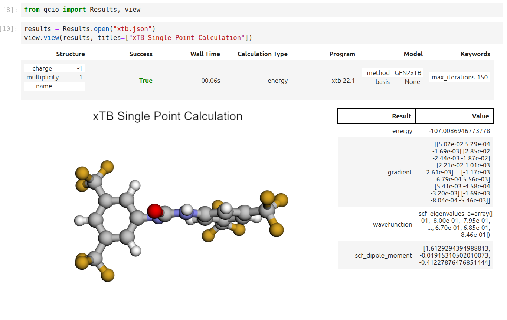

# Quantum Chemistry I/O

[](https://pypi.python.org/pypi/qcio)
[](https://pypi.python.org/pypi/qcio)
[](https://pypi.python.org/pypi/qcio)
[](https://github.com/coltonbh/qcio/actions)
[](https://github.com/coltonbh/qcio/actions)

Elegant and intuitive data structures for quantum chemistry, featuring seamless Jupyter Notebook visualizations.

`qcio` works in harmony with a suite of other quantum chemistry tools for fast, structured, and interoperable quantum chemistry.

## The QC Suite of Programs

- [qcconst](https://github.com/coltonbh/qcconst) - NIST/CODATA2022 core physical constants, conversion factors, and a periodic table with clear source information for every value.
- [qcio](https://github.com/coltonbh/qcio) - Elegant and intuitive data structures for quantum chemistry, featuring seamless Jupyter Notebook visualizations. [Documentation](https://qcio.coltonhicks.com)
- [qccodec](https://github.com/coltonbh/qccodec) - A translation layer between quantum chemistry program inputs and outputs and structured `qcio` objects.
- [qcop](https://github.com/coltonbh/qcop) - A package for operating quantum chemistry programs using `qcio` standardized data structures. Compatible with `TeraChem`, `psi4`, `QChem`, `NWChem`, `ORCA`, `Molpro`, `geomeTRIC` and many more.
- [BigChem](https://github.com/mtzgroup/bigchem) - A distributed application for running quantum chemistry calculations at scale across clusters of computers or the cloud. Bring multi-node scaling to your favorite quantum chemistry program.
- `ChemCloud` - A [web application](https://github.com/mtzgroup/chemcloud-server) and associated [Python client](https://github.com/mtzgroup/chemcloud-client) for exposing a BigChem cluster securely over the internet.

## Installation

```bash
python -m pip install qcio
```

## Quickstart

`qcio` is built around a simple mental model: `Input` objects define quantum chemistry calculations, and a `Results` object defines the results.

All `qcio` objects can be serialized and saved to disk by calling `.save("filename.json")` and loaded from disk by calling `.open("filename.json")`. `qcio` supports `json`, `yaml`, and `toml` file formats. Binary data will be automatically base64 encoded and decoded when saving and loading.

### Input Objects

#### CalcInput - Core input object for a single QC calculation.

```python
from qcio import Structure, CalcInput
# xyz files or saved Structure objects can be opened from disk
caffeine = Structure.open("caffeine.xyz")
# Define the program input
prog_input = CalcInput(
    structure=caffeine,
    calctype="energy",
    keywords={"purify": "no", "restricted": False},
    model={"method": "hf", "basis": "sto-3g"},
    extras={"comment": "This is a comment"}, # Anything extra not in the schema
)
# Binary or other files used as input can be added
prog_input.add_file("wfn.dat")
prog_input.keywords["initial_guess"] = "wfn.dat"

# Save the input to disk in json, yaml, or toml format
prog_input.save("input.json")

# Open the input from disk
prog_input = CalcInput.open("input.json")
```

`Structure` objects can be opened from and saved as xyz files or saved to disk as `.json`, `.yaml`, or `.toml` formats by changing the extension of the file. For `.xyz` files precision can be controlled by passing the `precision` argument to the `save` method.

```python
caffeine = Structure.open("caffeine.xyz")
caffeine.save("caffeine2.json", precision=6)
caffeine.save("caffeine.toml")
```

#### CompositeCalcInput - Input object for a workflow that uses multiple QC calculations.

`CompositeCalcInput` objects can be used to power workflows that require multiple calculations. For example, a geometry optimization workflow might use `geomeTRIC` to power the optimization and use `terachem` to compute the energies and gradients.

```python
from qcio import Structure, CompositeCalcInput
# xyz files or saved Structure objects can be opened from disk
caffeine = Structure.open("caffeine.xyz")
# Define the program input
prog_input = CompositeCalcInput(
    structure=caffeine,
    calctype="optimization",
    keywords={"maxiter": 250},
    subprogram="terachem",
    subprogram_args = {
        "model": {"method": "hf", "basis": "sto-3g"},
        "keywords": {"purify": "no", "restricted": False},
    },
    extras={"comment": "This is a comment"}, # Anything extra not in the schema
)
```

#### FileInput - Input object for a calculation using native file formats.

`qcio` also supports the native file formats of each QC program with a `FileInput` object. Assume you have a directory like this with your input files for `psi4`:

```
psi4/
    input.dat
    geometry.xyz
    wfn.dat
```

You can collect these native files and any associated command line arguments needed to specify a calculation into a `FileInput` object like this:

```python
from qcio import FileInput
psi4_input = FileInput.from_directory("psi4")

# All input files will be loaded into the `files` attribute
psi4_input.files
# {'input.dat': '...', 'geometry.xyz': '...', 'wfn.dat': '...'}

# Add psi4 command line args to the input
psi4_input.cmdline_args.extend(["-n", "4"])

# Files can be dumped to a directory for a calculation
psi4_input.save_files("psi4")
```

#### Modifying Input Objects

Objects are immutable by default so if you want to modify an object cast it to a dictionary, make the desired modification, and then instantiate a new object. This prevents accidentally modifying objects that may already be referenced in other calculations--perhaps as `.input_data` on a `Results` object.

```python
# Cast to a dictionary and modify
new_input_dict = prog_input.model_dumps()
new_input_dict["model"]["method"] = "b3lyp"
# Instantiate a new object
new_prog_input = CalcInput(**new_input_dict)
```

### Results

Calculation values are stored in a `Results` object. `Results` may contain parsed data, files, logs, and additional details of the calculation. A `Results` object has the following attributes:

```python
output.input_data # Input data used for the calculation
output.success # Whether the calculation succeeded or failed
output.data # All structured data from the calculation
output.data.files # Any files returned by the calculation
output.logs # Logs from the calculation
output.plogs # Shortcut to print the logs in human readable format
output.provenance # Provenance information about the calculation
output.extras # Any extra information not in the schema
```

The `.data` attribute on a `Results` is polymorphic and may be either `Files`, `SinglePointData`, `OptimizationData`, `ConformerSearchData`, or any other `DataType` depending on the calculation requested. Available attributes for each data type can be found by calling `dir()` on the object.

```python
dir(results.data)
```

Results can be saved to disk in json, yaml, or toml format by calling `.save("filename.{json/yaml/toml}")` and loaded from disk by calling `.open("filename.{json/yaml/toml}")`.

## ✨ Visualization ✨

Visualize all your results with a single line of code!

First install the visualization module:

```sh
python -m pip install qcio[view]
```

or if your shell requires `''` around arguments with brackets:

```sh
python -m pip install 'qcio[view]'
```

Then in a Jupyter notebook import the `qcio` view module and call `view.view(...)` passing it one or any number of `qcio` objects you want to visualizing including `Structure` objects or any `Results` object. You may also pass an array of `titles` and/or `subtitles` to add additional information to the molecular structure display. If no titles are passed `qcio` with look for `Structure` identifiers such as a name or SMILES to label the `Structure`.


Seamless visualizations for `Results` objects make results analysis easy!


Single point calculations display their results in a table.



If you want to use the HTML generated by the viewer to build your own dashboards use the functions inside of `qcio.view.py` that begin with the word `generate_` to create HTML you can insert into any dashboard.

## Development

To get started with all development dependencies:

```sh
uv sync --all-groups
```

## Support

If you have any issues with `qcio` or would like to request a feature, please open an [issue](https://github.com/coltonbh/qcio/issues).
